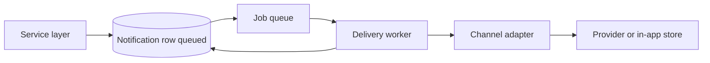

# Notification architecture and delivery

## 1. Purpose

This document defines how SmartPRO **models**, **authorizes**, **persists**, and **delivers** notifications so implementation can follow one pattern across channels (in-app, email, and future push/SMS).

It complements:

- `docs/core/ARCHITECTURE.md` — platform layers and async responsibilities
- `docs/core/DOMAIN_MODEL.md` — `Notification` entity fields and statuses
- `docs/architecture/TENANT_ISOLATION_MODEL.md` — company-scoped data and queries
- `docs/architecture/RBAC_MODEL.md` — `notifications:read` and `notifications:send`

---

## 2. Goals

1. **Tenant-safe** — every notification is tied to a company; delivery and listing respect membership and permissions.
2. **Reliable** — outbound work runs asynchronously with retries and clear terminal states.
3. **Observable** — operators can see queued, sent, failed, and cancelled rows; failures are traceable.
4. **Extensible** — new channels plug in behind a stable internal interface without rewriting domain workflows.

---

## 3. Conceptual model

### 3.1 Notification as durable record

The platform treats a **notification** as a **first-class, persisted intent to inform** a user (or role) within a tenant. Shape and lifecycle align with `docs/core/DOMAIN_MODEL.md` (`Notification`: `companyId`, `userId`, `channel`, `templateCode`, `status`, payload fields, timestamps).

**Statuses (normative meaning)**

| Status | Meaning |
|--------|---------|
| `queued` | Accepted and waiting for delivery worker; may be retried. |
| `sent` | Handed off to the channel provider or internal in-app store successfully. |
| `delivered` | Channel-specific confirmation when available (optional progression from `sent`). |
| `failed` | Exhausted retries or permanent channel error; requires operator or user action to retry or cancel. |
| `cancelled` | Superseded or explicitly withdrawn before successful send. |

### 3.2 Triggering vs delivery

- **Domain / service layer** decides *that* a notification should exist (after auth, validation, and business rules). It creates or requests a **notification record** in `queued` (or delegates to a small **notification command** API that does the same).
- **Async / job layer** performs *delivery* (template render, provider call, in-app fan-out) and updates status. User-facing HTTP handlers must not block on third-party latency.

This matches `docs/core/ARCHITECTURE.md`: notification triggering in the service layer; notifications in the async/job layer.

---

## 4. Delivery pipeline

High-level flow:

1. **Create** — Service persists a row with `status = queued`, `company_id` set, `user_id` and `channel` set, `template_code` and stable correlation metadata as needed.
2. **Enqueue** — A job message references the notification id (and tenant id for routing). Prefer **at-least-once** queue semantics with **idempotent** workers.
3. **Process** — Worker loads the row, verifies tenant and that status is still `queued` (or retryable), resolves template and locale, invokes the **channel adapter**.
4. **Complete** — On success: `sent` (then `delivered` if the channel confirms). On retryable failure: requeue with backoff. On permanent failure: `failed` with error metadata.
5. **Read path** — In-app UI and APIs list notifications for the current user within the active company using `notifications:read` and tenant-scoped queries.

---

## 5. Channel adapters

A **channel adapter** is the only place that talks to email APIs, push gateways, or writes in-app notification feeds.

**Responsibilities**

- Map internal template + variables to channel-specific payload.
- Perform the external or internal write.
- Return structured success or failure (retryable vs permanent).

**Rules**

- Adapters are **stateless** regarding business rules; they consume already-authorized, already-persisted intents.
- Secrets for providers live in environment or secret stores, not in application tables.
- Adding a channel means adding an adapter and registering it for a `channel` enum/value; domain code stays channel-agnostic where possible.

---

## 6. Templates and content

- **`templateCode`** identifies a stable template key in code or a governed template registry (versioning is a future concern; keys must remain stable for audit and replay).
- Rendering uses **sanitized** variable substitution; untrusted HTML must not bypass escaping rules for email and in-app HTML surfaces.
- **Preference and consent** (marketing vs transactional) are enforced **before** creating the row or in the same transaction as creating a `cancelled` outcome—transactional and security alerts may bypass marketing opt-out per product policy when explicitly documented.

---

## 7. Tenant isolation and RBAC

- Every notification row includes **`company_id`** per `docs/architecture/TENANT_ISOLATION_MODEL.md`.
- **List / read** endpoints require `notifications:read` and filter by the caller’s permitted company and user scope (users see their own; admins may see broader tenant views only where product rules explicitly allow and audit).
- **Send / enqueue** for operator-driven or bulk actions requires `notifications:send` in addition to company scope.
- Cross-tenant access is forbidden unless following the platform’s explicit exception pattern (documented, minimal, audited).

---

## 8. Audit and compliance

- Routine automated notifications from workflows do not require a separate audit row per message unless product policy demands it.
- **Privileged sends** (e.g. operator impersonation, cross-tenant support actions, bulk campaigns) **must** emit audit events consistent with `docs/architecture/AUDIT_LOGGING_PATTERN.md` (actor, company scope, action, entity reference).
- Do not log full message bodies or secrets in audit metadata; use ids and template codes.

---

## 9. Idempotency and duplicates

- Workers must tolerate duplicate jobs: use notification id as idempotency key; skip or no-op if status is no longer `queued`.
- Domain services should avoid duplicate **business** notifications where harm would result (e.g. double billing alerts) using a **dedupe key** stored on the notification or a short-lived idempotency record—exact mechanics are implementation detail but the architecture requires an explicit strategy per use case.

---

## 10. Out of scope for this document

- Concrete provider selection (SendGrid, SES, FCM, etc.) and infrastructure diagrams.
- Exact queue technology (Redis, SQS, in-DB polling)—the contract is **async boundary + idempotent worker**.
- End-user notification preferences UI—only the rule that preferences gate **eligible** sends.

---

## 11. Implementation sequencing (reference)

When this architecture is implemented in code, a sensible order is:

1. Schema and repository for notifications (tenant-scoped).
2. Internal API or service method to enqueue from domain workflows.
3. Worker skeleton with one channel (in-app or email).
4. Integration tests for tenant isolation and status transitions.
5. Additional channel adapters and retry policy tuning.

---

## 12. Summary

Notifications are **company-scoped durable intents** created by the domain layer and **delivered asynchronously** by channel-specific adapters under RBAC. The quality bar is **tenant safety**, **clear lifecycle states**, **idempotent workers**, and **audit for privileged sends**.
